  

*喧闹任其喧闹，自有我自为之，我自风情万种，与世无争。*

 

## 关于我

- 🎓 北京印刷学院 · 信息安全专业
- 🚩 CTF 玩家，比赛之余会把 writeup 整理丢进仓库里
- 🛠️ 喜欢捣鼓系统级的小工具 —— 人脸解锁增强、shellcode 加载器、托盘小工具之类
- 🌱 目前在钻研 Windows 平台开发与逆向相关的东西
- 📍 Beijing

 

## 技术栈

 

## GitHub 数据

<table>
<tr>
<td width="58%"></td>
<td width="42%"></td>
</tr>
</table>

  

> 以上统计图由本仓库的 GitHub Actions 每日自动生成并提交（[`.github/workflows/metrics.yml`](.github/workflows/metrics.yml)），不依赖任何第三方共享服务，不会再出现裂图。

 

## 精选项目

| 项目 | 说明 | 技术栈 |
| --- | --- | --- |
| [**FaceWinUnlock-Tauri**](https://github.com/starnotes-xj/FaceWinUnlock-Tauri) ⭐ 15 | 基于 Tauri 的 Windows 人脸识别解锁增强，自定义 Credential Provider 注入登录界面 | Rust · Vue3 · OpenCV |
| [**wecomdl**](https://github.com/starnotes-xj/wecomdl) | 企业微信直播回放下载辅助工具 | Go |
| [**BIGC_CTF_Writeups**](https://github.com/starnotes-xj/BIGC_CTF_Writeups) | CTF 比赛 writeup 整理 | Python |
| [**Shellcode-Executor**](https://github.com/starnotes-xj/Shellcode-Executor) | Shellcode 加载执行工具 | Go |
| [**traymond**](https://github.com/starnotes-xj/traymond) | 窗口最小化到系统托盘的小工具 | C++ |
| [**Fuck-BIGC-JJFZ**](https://github.com/starnotes-xj/Fuck-BIGC-JJFZ) ⭐ 3 | 北京印刷学院积极分子刷课脚本 | Java |

 

